# Hotels Booking

Project developed in Angular 18 and in the service using NodeJS with Express, the project is focused on making reservations in the different hotels that are registered, users could make a reservation following reservation policies to cancel a reservation, to see information of the different registered hotels as information of the prices of the rooms per night, the location on an interactive map, photos of the hotel and a form to choose the number of rooms and the reservation data, a user can view their reservations by logging into the application before creating an account, in this list you can see the details of the reservation, photos of the hotel and a form to choose the number of rooms and reservation data, a user can view their reservations by logging into the application before creating an account, in this list you can see the details of the reservation, the user can not cancel reservations that are for the following 3 days of the current day in which you want to cancel the reservation, similarly users can not cancel reservations that have more than 2 days since its creation.

## Stack

### Client
- Angular V18 - Typescript
- Leaflet

### Server
- Node JS
- Express
- MongoDB
- Mongosee
- Passport

## Installation
The requirements you must have are:
- Node V24^
- MongoDB
1. Clone the repository

2. To start the application, you must configure the variables in the .env.example files of the service, then install the dependencies of the client and service

```script
    npm install
```

3. Start both projects with the command

```script
    npm start
```

## Home page
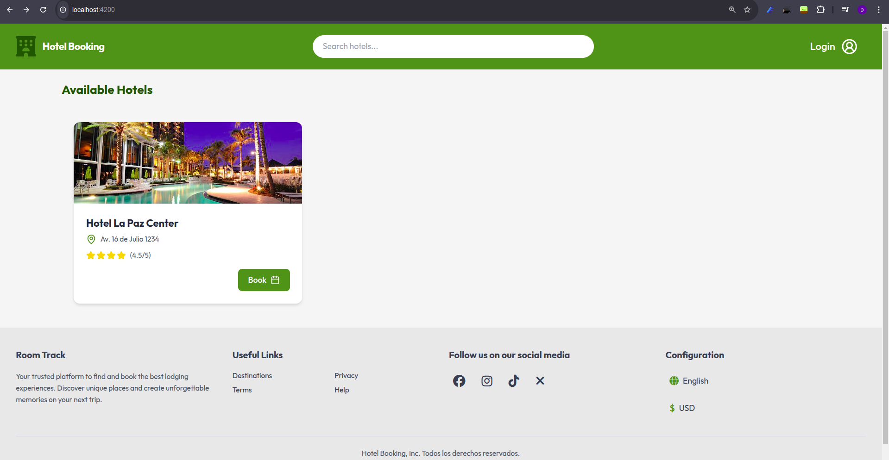

Hotel details:

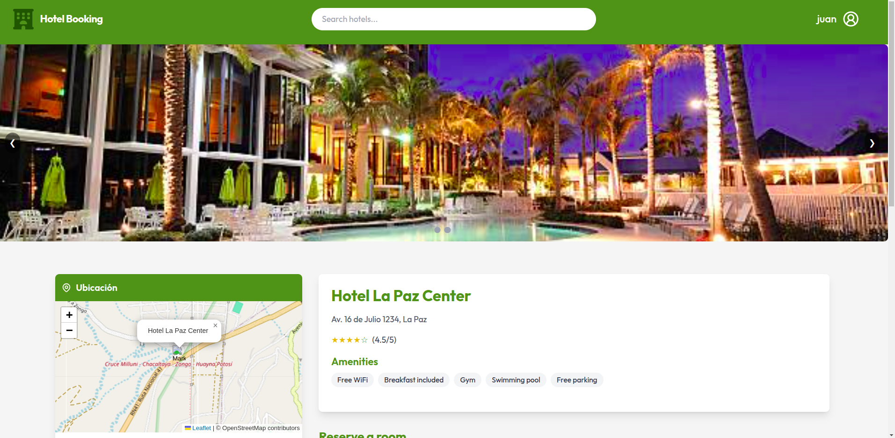

Reservation Form

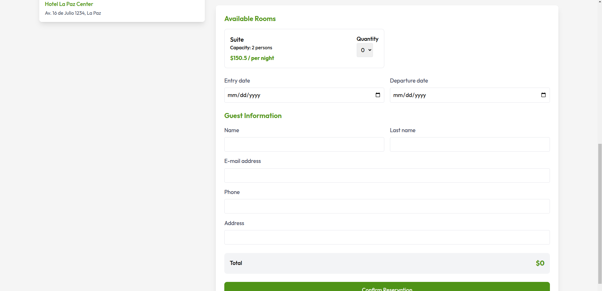

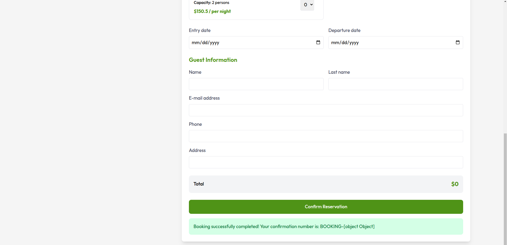

Reservations for user:

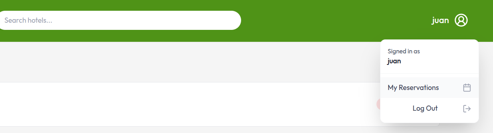

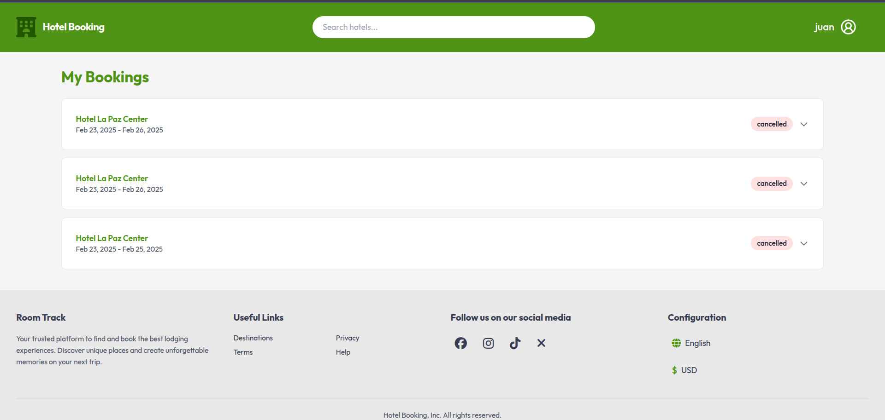

Filters:

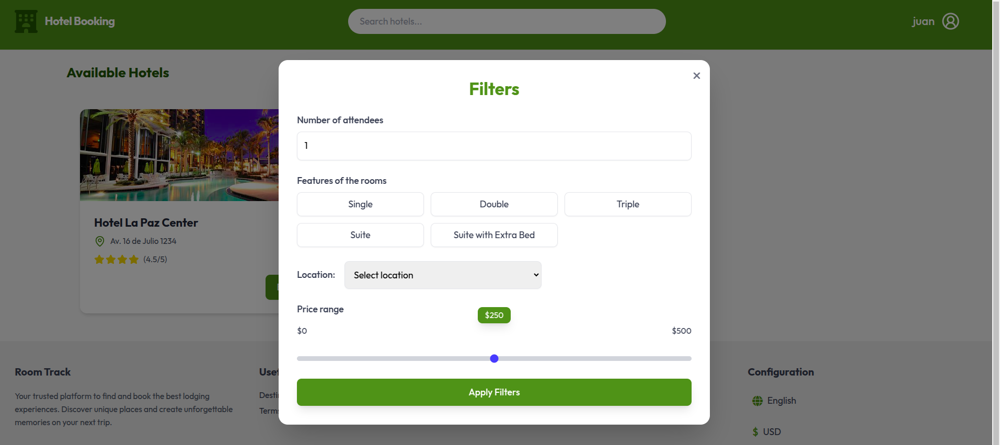


# Service

In this MR will be implemented crud operations for rooms and rename the structure of the project, then the filtering functionality is complete for hotels and rooms, swagger is configurated.

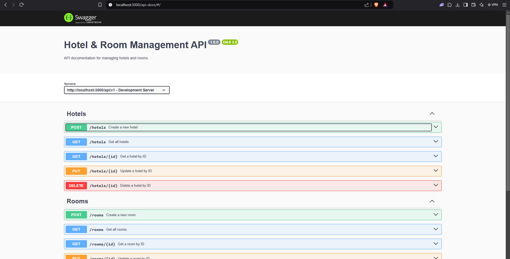


## Hexagonal Architecture

### Layers the Project
- **Domain Layer (src/domain/)**

#### Represents the core business logic
- Entities (entities/): Defines the main business objects like Hotel.js.
- Ports (ports/output/): Defines interfaces like HotelRepositoryPort.js that act as contracts for data access.
- Services (services/): Implements business rules, such as HotelService.js and RoomService.js.

#### Application Layer (src/application/)

- Handles controllers (controllers/) to process API requests.
- Includes middlewares (middlewares/) for request handling (e.g., errorHandler.js).
- Manages custom errors (errors/customError.js).

#### Adapters Layer (src/adapters/)

Implements the repositories, which act as bridges between the business logic and external data sources.

- Handles database configuration (database/mongoose/).
- Defines models to interact with MongoDB.
- Manages routes (server/routes/), defining API endpoints.

Initializes the application in app.js.

#### How It Works in Your Project

1. The domain layer does not depend on external frameworks.
1. The application layer calls the domain services, which use ports to communicate with adapters (repositories).
1. The infrastructure layer is independent and can be replaced without affecting the business logic.

### Foder Structure

```bash
├── eslint.config.mjs
├── package.json
├── package-lock.json
├── pnpm-lock.yaml
├── README.md
├── server.js
├── src
│   ├── adapters
│   │   └── repositories
│   │       ├── HotelRepository.js
│   │       └── RoomRepository.js
│   ├── application
│   │   ├── controllers
│   │   │   ├── HotelController.js
│   │   │   └── RoomController.js
│   │   ├── errors
│   │   │   └── customError.js
│   │   └── middlewares
│   │       └── errorHandler.js
│   ├── domain
│   │   ├── entities
│   │   │   └── Hotel.js
│   │   ├── ports
│   │   │   └── output
│   │   │       └── HotelRepositoryPort.js
│   │   └── services
│   │       ├── HotelService.js
│   │       └── RoomService.js
│   └── infrastructure
│       ├── app.js
│       ├── database
│       │   └── mongoose
│       │       ├── connection.js
│       │       ├── HotelModel.js
│       │       └── RoomModel.js
│       └── server
│           └── routes
│               ├── hotels.js
│               ├── index.js
│               └── rooms.js
└── swaggerOptions.js
```

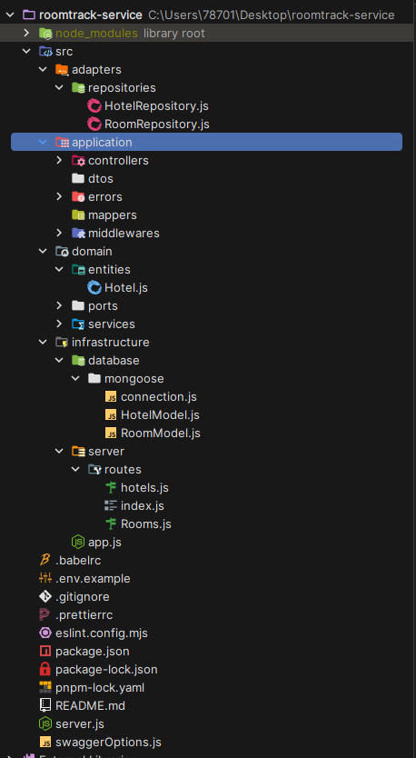

#### Dependencies (For Production Use)

- class-validator: Provides decorators and validation utilities for validating request data, ensuring data integrity in APIs
- cors: Enables Cross-Origin Resource Sharing (CORS), allowing your API to handle requests from different origins
- dotenv: Loads environment variables from a .env file
- express: A fast, minimalist web framework for Node.js used to create your API endpoints and manage HTTP requests
- mongoose: An Object Data Modeling (ODM) library for MongoDB, helping you define schemas and interact with the database easily
- swagger-jsdoc: Generates OpenAPI (Swagger) documentation based on JSDoc comments in your code
- swagger-ui-express: Serves Swagger UI in an Express app, allowing users to visualize and test API endpoints interactively

#### DevDependencies (For Development & Testing)

- @babel/preset-env: A Babel preset that compiles modern JavaScript to ensure compatibility with older environments
- eslint: A static code analysis tool that helps enforce coding standards and detect potential issues in your JavaScript code
- eslint-config-prettier: Disables ESLint rules that conflict with Prettier, ensuring a consistent code style
- eslint-plugin-prettier: Integrates Prettier into ESLint, so formatting issues can be reported as ESLint errors
- jest: A JavaScript testing framework used for writing and running unit tests
- prettier: A code formatter that ensures consistent styling across the project


In the src/app.js file, We set up a basic Express server with the necessary middleware for handling JSON requests and managing CORS. Here's a breakdown of what I implemented:

```javascript
const app = express(); //creates an instance of the Express framework to handle HTTP requests.
```

We used swagger-jsdoc and swagger-ui-express to generate and serve API documentation at /api-docs.
Enabled CORS:

```javascript
app.use(cors()); //allows requests from different origins, for example frontend applications or external services can interact with the API without restrictions.
```

#### Enabled JSON Parsing Middleware:

```javascript
app.use(express.json()); //ensures that incoming request bodies are automatically parsed as JSON, making it easier to handle request data
```

##### Defined API Routes:

```javascript
app.use("/api/v1", routes); //sets up all the API endpoints under /api/v1, keeping the project structured and organized
```

##### Added a Global Error Handler:

```javascript
app.use(errorHandler); //is a centralized error-handling middleware to catch and process application errors
```

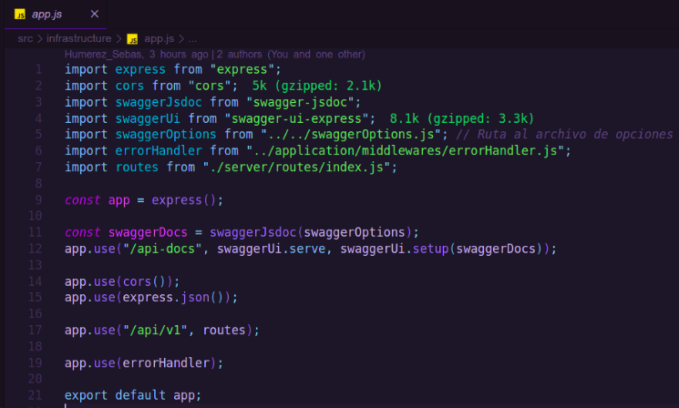

### Design and implementation of routes for rooms and hotels.

Routes were designed and implemented to carry out the CRUD of Hotel Rooms operations.

### Hotels

#### POST **/api/v1/hotels**

Body:
```json
{
  "name": "Grand Palace Hotel",
  "location": {
    "address": "123 America Street",
    "city": "La Paz",
    "coordinates": {
      "latitude": 40.7128,
      "longitude": -74.0060
    }
  },
  "amenities": ["Free WiFi", "Swimming Pool", "Spa", "Gym"],
  "rating": 4.5,
  "images": [
    "https://example.com/images/hotel1.jpg",
    "https://example.com/images/hotel2.jpg"
  ],
  "rooms": []
}
```

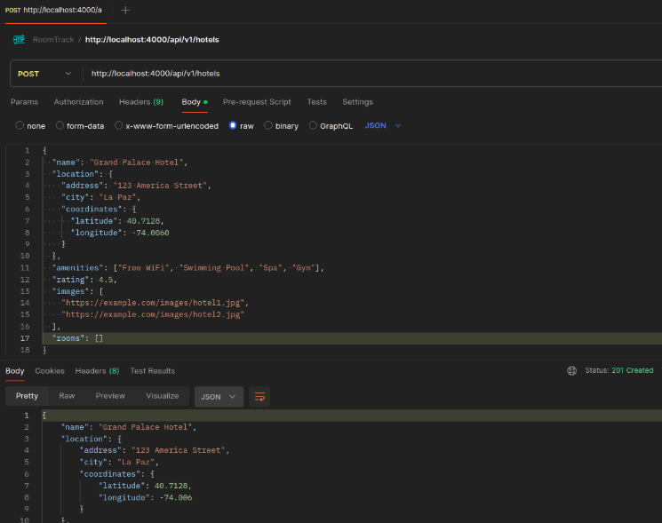

#### GET **/api/v1/hotels**

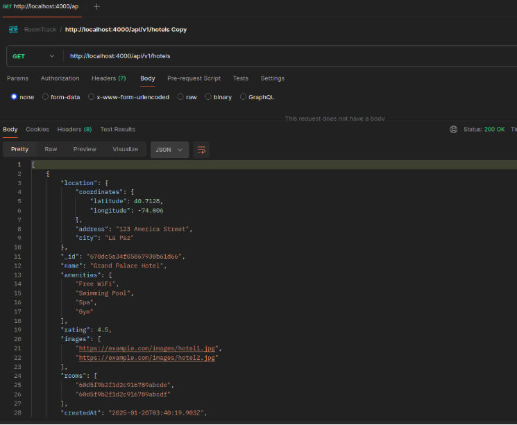

#### GET **/api/v1/hotels/{ID_Hotel}**


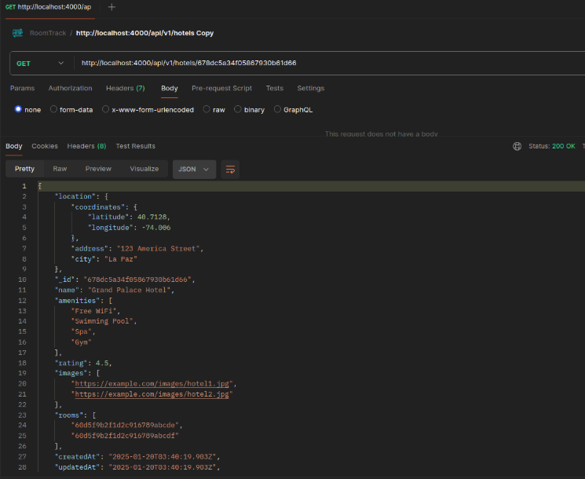

#### PUT **/api/v1/hotels/{ID_Hotel}**

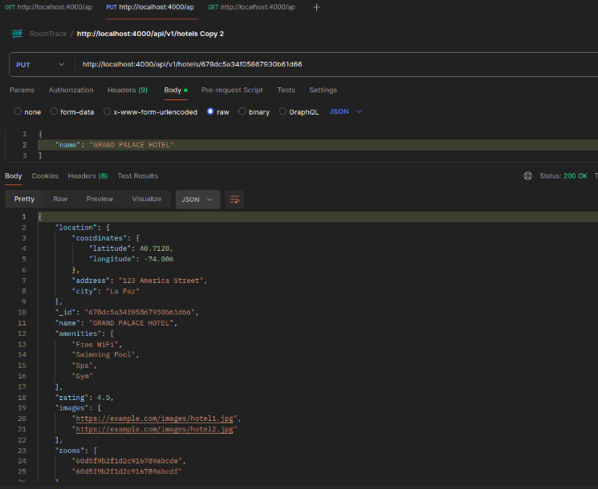

#### DELETE **/api/v1/hotels/{id}**


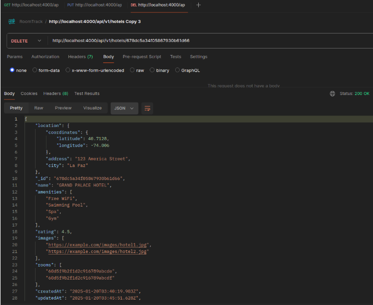

### Rooms

#### POST **/api/v1/rooms**

Body:
```json
{
  "hotel": "678dc6484f05867930b61d6e",
  "type": "Suite",
  "capacity": 4,
  "price": 150.00,
  "amenities": ["Air Conditioning", "Free WiFi", "Mini Bar", "Smart TV"],
  "isAvailable": true
}
```

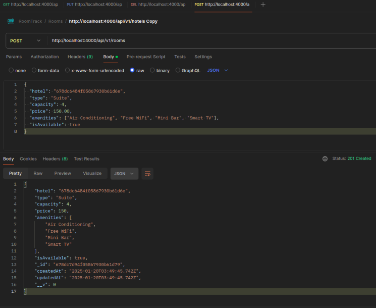

#### GET **/api/v1/rooms**


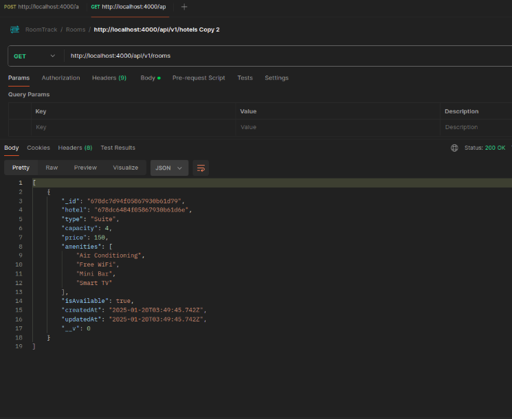

#### GET **/api/v1/rooms/{ID_Room}**

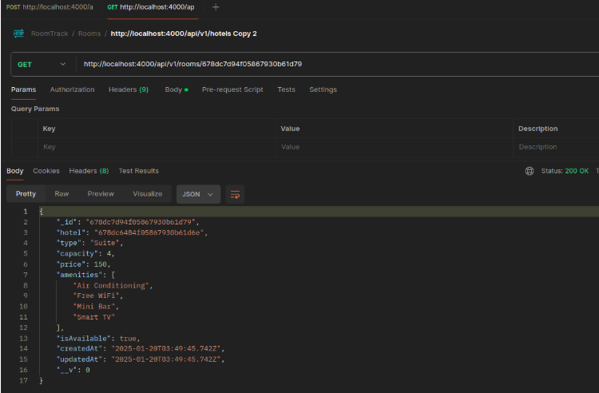

#### DELETE **/api/v1/rooms/{ID_Room}**

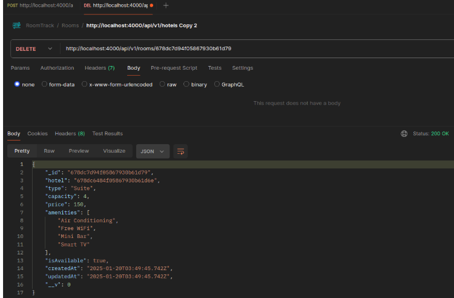

Intergration was made with the MongoDB database for data persistence of all these enpoints.

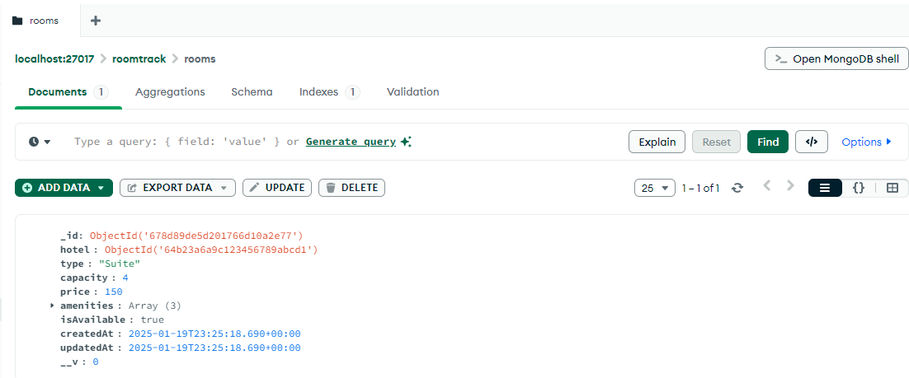


### Implementation of the Room Finder


### Documenting Routes in Express with Swagger

You are documenting API routes with Swagger using JSDoc comments in Express. We define the model schema and specify the endpoints e.g. /hotels with their methods (POST, GET), including input parameters, filters, and expected responses.

